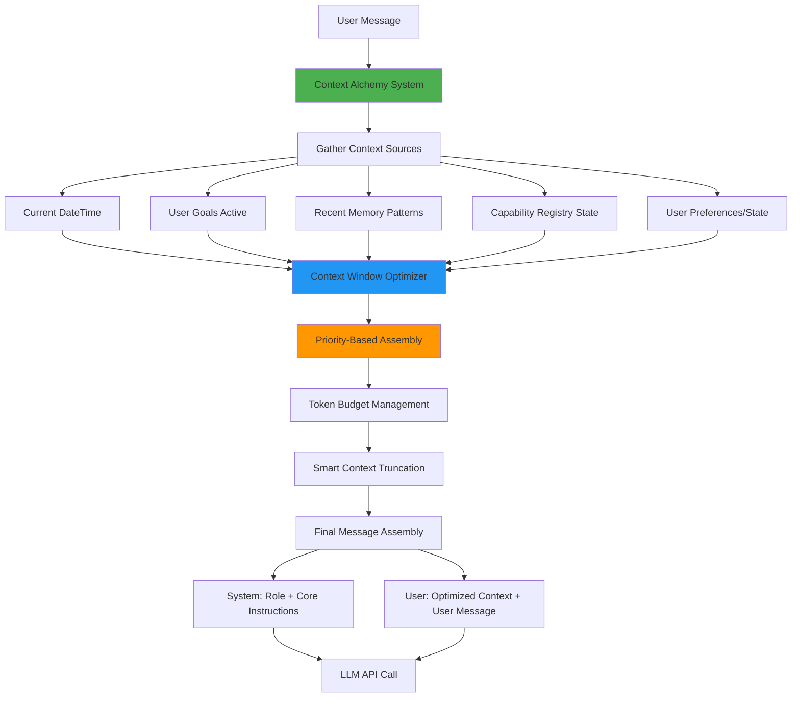

# LLM Context Assembly Flow Analysis

## Current Message Assembly Process

```mermaid
flowchart TD
    A[User Message] --> B[orchestrateMessage]
    B --> C[getLLMResponseWithCapabilities]

    C --> D[Load capability_instructions from DB]
    D --> E{DB Load Success?}

    E -->|Success| F[Replace {{USER_MESSAGE}} with actual message]
    F --> G[Get memory patterns]
    G --> H[Get goal whisper]
    H --> I[Add current date/time context]
    I --> J[Inject past experiences if available]
    J --> K[Inject goal whisper if available]
    K --> L[Apply model-aware prompting]
    L --> M[Call openRouterService.generateResponse]

    E -->|Failure| N[Generate DYNAMIC fallback instructions]
    N --> O[Add current date/time context to fallback]
    O --> P[Get goal whisper for fallback]
    P --> Q[Inject goal whisper into fallback]
    Q --> R[Apply model-aware prompting to fallback]
    R --> S[Call openRouterService.generateResponse]

    M --> T[OpenRouter assembles final messages]
    S --> T

    T --> U[System Message: Basic Coach Artie prompt + optional context]
    T --> V[User Message: The processed instructions with all injections]

    U --> W[Send to LLM API]
    V --> W
    W --> X[LLM Response]

    style A fill:#e1f5fe
    style X fill:#c8e6c9
    style N fill:#ffecb3
    style T fill:#f3e5f5
```

## Problems Identified

### 1. **HARDCODED FALLBACK MESS**

```typescript
// This is the hardcoded fallback that bypasses our context system:
const dynamicInstructions = this.generateDynamicCapabilityInstructions(message.message);
```

### 2. **DOUBLE CONTEXT INJECTION**

- Date/time gets added TWICE (main path + fallback)
- Goal whisper gets added TWICE
- Memory patterns only in main path

### 3. **PRIMITIVE MESSAGE ASSEMBLY**

The OpenRouter service uses a basic system prompt:

```typescript
const systemPrompt = `You are Coach Artie, a helpful and encouraging AI assistant...
${context ? `Context from previous conversations: ${context}` : ''}`;
```

### 4. **NO CONTEXT ALCHEMY**

We're not using sophisticated context window management - just string replacement!

## What We Should Have Instead



## Immediate Fixes Needed

1. **DELETE** the hardcoded fallback instructions
2. **BUILD** a proper context alchemy system
3. **CONSOLIDATE** all context injection into one smart system
4. **ELIMINATE** duplicate date/time and goal whisper injection
